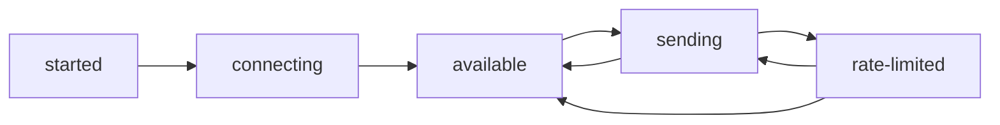

golare
=====

A sentry SDK for erlang

Build
-----

    $ rebar3 compile

Transport states
-----

```mermaid
flowchart LR
    started --> connecting
    connecting --> available
    available --> sending
    sending --> available
    sending --> rate-limited
    rate-limited --> available
    rate-limited --> sending
```

