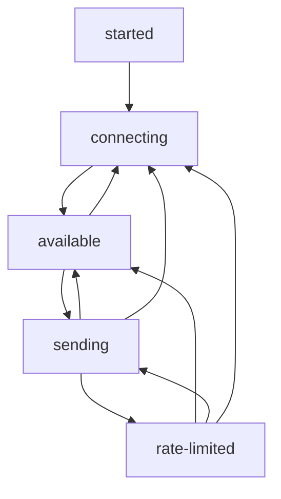

golare
=====

A sentry SDK for erlang

Build
-----

    $ rebar3 compile

OTP Logger
-----

Golare will register itself as an OTP logger handler. The handler will re-shape the logged event to be a sentry event, and send it to the
transport `gen_statem`.

Process scope
-----

The `sentry` module can be used to put values in the process dictionary for sentry to use if capturing events in the same process.

Currently supported is http request context, and user context.

Transport states
-----

Initial state is `started` and it will send itself an internal event to connect to the configured DSN, so it transitions to `connecting`. 

The `connecting` state waits for the sentry link to be up, at which point it transitions to `available`.

If the transport is `available` we will transition to `sending` if an event capture happens.

In state `sending` we have outstanding requests on the wire waiting for responses. When all responses have been
received and there are no more events to send it goes back to `available`.

During `sending` sentry can respond with a HTTP 429 (too many requests), and transport goes into `rate-limited`
state until the backoff expires.

When `rate-limited` expires, it will go back to `sending` or `available` depending on if there is events queued to send.

During `rate-limited` any captured events are queued up, and if the queue is too long it will spill events, just like other
states.

In any connected state, if the link goes down it tries to reconnect and goes to state `connecting`.

